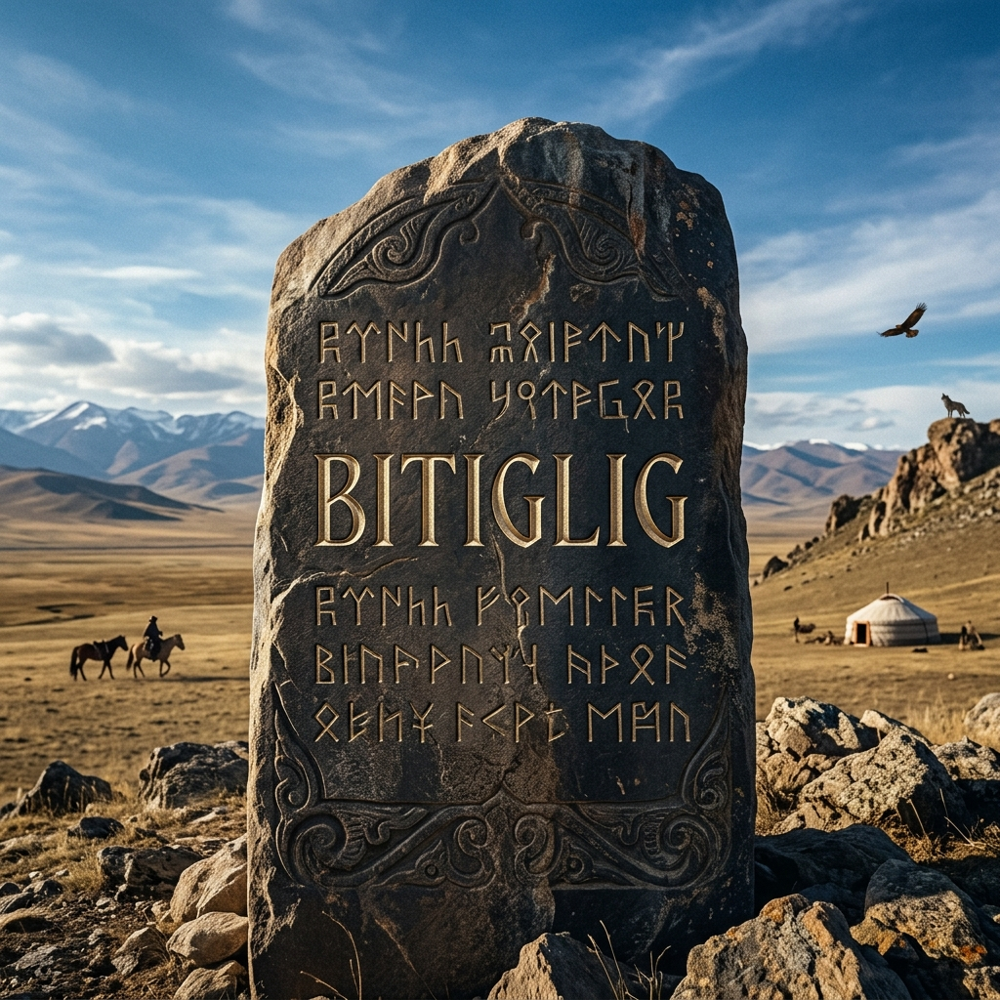

  

# 🐺 Bitiglig

Eski Türkçede "kitaplık, kütüphane ve yazılı olan" anlamlarına gelen **Bitiglig**, Göktürk dilini ve Orhun alfabesini (Runik Türk Alfabesi) sıfırdan öğrenmek, gramer yapısını incelemek ve bu kadim dili öğretmek amacıyla oluşturulmuş açık kaynaklı bir bilgi deposudur.

Türk dilinin bilinen ilk yazılı kaynakları olan 8. yüzyıl Orhun Yazıtları'nın dilini anlamak, sadece tarihi bir merak değil, aynı zamanda modern Türk dillerinin kökenini kavramak için de harika bir serüvendir. Bitiglig, bu serüvene atılmak isteyen herkes için bir başvuru kaynağı olmayı hedefler.

---

## 📌 İçindekiler

- [Neden Bitiglig?](#-neden-bitiglig)
- [Başlamadan Önce: Font Kurulumu](#-başlamadan-önce-font-kurulumu)
- [Detaylı Depo Yapısı](#-detaylı-depo-yapısı)
- [Öğrenme Yol Haritası (Roadmap)](#-öğrenme-yol-haritası-roadmap)
- [Sıkça Sorulan Sorular (SSS)](#-sıkça-sorulan-sorular-sss)
- [Katkıda Bulunma](#-katkıda-bulunma)
- [Lisans](#-lisans)

---

## 💡 Neden Bitiglig?

İnternette Göktürkçe ile ilgili birçok dağınık bilgi bulunuyor. **Bitiglig**, bu bilgileri akademik bir ağırlıktan çıkarıp, modern ve sistematik bir mantıkla yapılandırır:
* **Modüler Öğrenme:** Alfabe, gramer ve sözlük birbirinden bağımsız ama bağlantılı şekilde ayrılmıştır.
* **Pratik Odaklı:** Sadece kural ezberletmez, gerçek anıt metinleri üzerinden satır satır çözümleme sunar.
* **Açık Kaynak:** Büyümeye ve topluluk destekli gelişime açıktır.

---

## ⚙️ Başlamadan Önce: Font Kurulumu

Göktürkçe karakterlerin (Tamgaların) bilgisayarınızda veya tarayıcınızda kare kutucuklar (▯) şeklinde görünmemesi için sisteminize Eski Türk alfabesini destekleyen bir yazı tipi (font) kurmanız gerekmektedir.

1. **Önerilen Font:** [Noto Sans Old Turkic](https://fonts.google.com/noto/specimen/Noto+Sans+Old+Turkic) (Google Fonts)
2. Fontu indirin ve sisteminize (Windows/macOS/Linux) kurun.
3. Artık depodaki orijinal metinleri sorunsuz görüntüleyebilirsiniz! (Örnek: 𐱅𐰇𐰼𐰜)

---

## 📂 Detaylı Depo Yapısı

Projeyi adım adım takip edebilmeniz için klasörleri mantıksal bir sıraya oturttuk:

* **`01_Alfabe/`**
  * `tamgalar.md`: 38 harfin ses değerleri, ünlü/ünsüz uyumları ve kalın/ince karakter farkları.
  * `yazim_kurallari.md`: Sağdan sola yazım mantığı, kelime ayırıcı (üst üste iki nokta) kullanımı.
* **`02_Gramer/`**
  * `isimler_ve_ekler.md`: İsim çekimleri, çokluk ekleri ve iyelik.
  * `fiiller_ve_zamanlar.md`: Geçmiş zaman, geniş zaman ve emir kipleri.
  * `ses_uyumlari.md`: Büyük ve küçük ünlü uyumunun temelleri.
* **`03_Sozluk/`**
  * `temel_kelimeler.csv`: Sık kullanılan kelimelerin günümüz Türkçesi ve İngilizce karşılıkları.
  * `zaman_mekan_adlari.md`: Günler, aylar, yönler ve coğrafi terimler.
* **`04_Yazit_Okumalari/`**
  * `kul_tigin/`: Kül Tigin anıtından seçme cümlelerin orijinali, transkripsiyonu ve günümüz çevirisi.
  * `bilge_kagan/`: Bilge Kağan anıtından bölümler.
* **`05_Kaynaklar/`**
  * `kitap_ve_makale_onerileri.md`: Talat Tekin, Muharrem Ergin gibi uzmanların eserleri ve dijital kaynaklar.

---

## 🗺️ Öğrenme Yol Haritası (Roadmap)

Kendi kendinize çalışırken şu sırayı takip etmenizi öneririz:

- [ ] **Aşama 1:** Harfleri tanı ve fontları kur. Temel heceleme mantığını anla.
- [ ] **Aşama 2:** Kendi adını ve kısa kelimeleri Göktürk harfleriyle (sağdan sola) yazmayı dene.
- [ ] **Aşama 3:** Temel gramer kurallarını (isim ve fiil çekimleri) oku.
- [ ] **Aşama 4:** `04_Yazit_Okumalari` klasöründeki kısa cümleleri sözlük yardımıyla kendin çevirmeye çalış.

---

## ❓ Sıkça Sorulan Sorular (SSS)

**S: Göktürkçe öğrenmek zor mu?**
C: Hayır! Özellikle modern Türkçe konuşan biri için cümle yapısı (Özne-Nesne-Yüklem) ve ek mantığı tamamen aynıdır. Sadece yeni bir alfabe ve bazı eski kelimeleri öğrenmeniz gerekecek.

**S: Metinler neden sağdan sola yazılıyor?**
C: Dönemin taşa kazıma teknikleri ve Orta Asya'daki yazı gelenekleri nedeniyle Orhun alfabesi sağdan sola (ve bazen yukarıdan aşağıya) yazılır.

**S: Bu dili günümüzde konuşan var mı?**
C: Eski Türkçe doğrudan bu haliyle konuşulmuyor. Ancak günümüzdeki Türkiye Türkçesi, Azerbaycan Türkçesi, Özbekçe ve Kazakça gibi dillerin atasıdır. 

---

## 🤝 Katkıda Bulunma (Contributing)

**Bitiglig** topluluk odaklı bir projedir. Geliştirmelere, düzeltmelere ve yeni örneklere her zaman açığız! Katkı sağlamak için:

1. Bu repoyu **Fork**'layın.
2. Üzerinde çalıştığınız özellik için yeni bir dal oluşturun (`git checkout -b feature/GramerDuzenlemesi`).
3. Değişikliklerinizi yapın ve commit'leyin (`git commit -m 'Gramer dosyasındaki yazım hatası düzeltildi'`).
4. Dalınızı (branch) kendi deponuza push'layın (`git push origin feature/GramerDuzenlemesi`).
5. Bir **Pull Request (PR)** açarak bize gönderin.

Lütfen açtığınız PR'larda neyi değiştirdiğinizi kısaca açıklamayı unutmayın.

---

## 📜 Lisans

Bu proje **MIT Lisansı** altında lisanslanmıştır. Detaylar için [LICENSE](LICENSE) dosyasına bakabilirsiniz. 

> *"Türk Oğuz beyleri, milleti, işitin: Üstte mavi gök çökmedikçe, altta yağız yer delinmedikçe, senin ilini ve töreni kim bozabilir?"*
